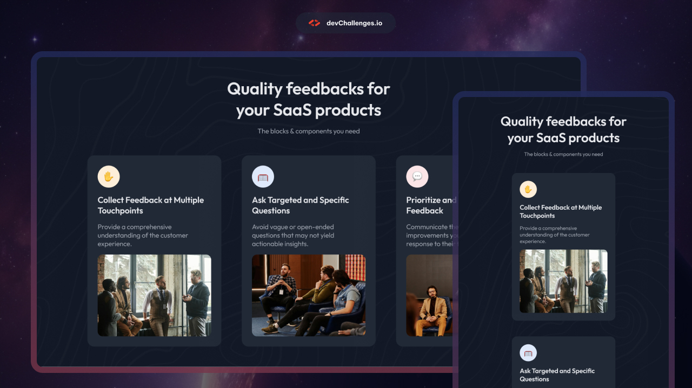

# Simple Feature Section | devChallenges

   Solution for a challenge <a href="https://devchallenges.io/challenge/simple-feature-section-challenge" target="_blank">Simple Feature Section</a> from <a href="http://devchallenges.io" target="_blank">devChallenges.io</a>.

  <h3>
    <a href="#">
      Demo
    </a>
     | 
    <a href="https://devchallenges.io/challenge/simple-feature-section-challenge">
      Challenge
    </a>
  </h3>

## Table of Contents

- [Overview](#overview)
  - [What I learned](#what-i-learned)
- [Built with](#built-with)
- [Features](#features)
- [Acknowledgements](#acknowledgements)
- [Author](#author)

## Overview

I created a features section that actually looks like what you'd see on a real website. Three cards showing different features, each with an emoji, a title, a description, and an image. It seems simple until you try to make it work on any screen size.

The tricky part was nesting the FlexBox containers to achieve the perfect layout. The desktop version displays three columns, while the mobile version stacks everything vertically. This looks complicated, but it's easier than it seems. Trust me.

### What I learned

- **Nested FlexBox is powerful but confusing**: Using FlexBoxes inside FlexBox containers gave me much more control over how elements align and fit.

- **Scalable Spacing**: What looks good on desktop can feel cramped on mobile devices. I had to adjust the width for different screen sizes without overdoing it.

- **Typographic hierarchy in small spaces**: Making titles legible without overwhelming descriptions, especially when cards become narrower on mobile devices.

## Built with

- HTML5 Semantic Structure
- CSS3 Flexbox Layouts
- Nested Flexbox Containers
- CSS Media Queries
- Responsive Typography
- Mobile-first Design Approach

## Features

- **Three-to-One Responsive Layout**: Cards are arranged in three columns on desktop and stacked vertically on mobile, with seamless transitions between breakpoints.

- **Clean Card Layout**: Each feature card has even spacing, legible typography, and proper visual hierarchy between emojis, title, and description.

- **Nested Flexbox Structure**: The parent container manages the overall layout, while child containers manage the alignment of each card's content.

Another [DevChallenges](https://devchallenges.io/challenges-dashboard) exercise that reinforced the importance of flexbox for modern web designs.

## Acknowledgements

- [DevChallenges.io](https://devchallenges.io/) for providing realistic design challenges that mirror actual client work

## Author

- Website [simple feature section](#)
- GitHub [@gvillarroel-dev](https://github.com/gvillarroel-dev)